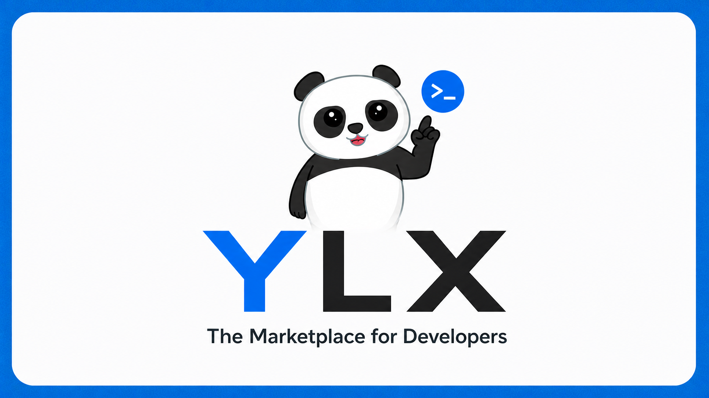

# YLX — The Marketplace for Developers

A developer-first classifieds marketplace for buying and selling tech gear
directly.



> YLX is in early development.

## Workspace

- `apps/api` — Go API
- `apps/web` — TanStack Start web application
- `packages/ui` — Shared YLX design system and components

## Getting started

### Requirements

- Go 1.26.6+
- Node.js 22.12.0+
- pnpm 10
- Docker

### Run locally

```sh
pnpm install
cp apps/api/.env.example apps/api/.env
docker compose -f apps/api/compose.yml up -d
make -C apps/api migrate
pnpm dev
```

The web application runs at `http://localhost:3000` and the API at
`http://localhost:8080`.
